# Top 25 All-in-One Digital Marketing Platforms Ranked in 2025 (Latest Compilation)

**Struggling with too many marketing tools?** Many entrepreneurs juggle separate apps for website building, email campaigns, sales funnels, and automation – leading to chaos and high costs. All-in-one marketing platforms solve this **pain point** by putting **website builder**, **email marketing**, **funnel design**, **CRM**, and more under one roof. This **comprehensive roundup** looks at the top solutions of 2025 that can streamline your **digital marketing** efforts, boost efficiency, and grow your business with **everything in one place**.

## [Builderall](https://builderall.com) – Complete Marketing Suite for Online Business

*All-in-one marketing suite with website, funnel, eLearning, and automation tools for entrepreneurs.*

**Builderall** is a versatile **digital marketing platform** offering a wide range of tools to create and manage websites, sales funnels, online stores, email campaigns, and even online courses. It’s designed for **individuals and small businesses** to build an online presence without needing multiple subscriptions. With an intuitive **drag-and-drop website builder** and funnel creator, you can design landing pages and full sales funnels to capture leads and drive sales. It also includes an **email marketing system**, allowing you to automate follow-ups and segment your audience. Unique features like a **built-in e-learning platform**, **webinar hosting**, and even an **app builder** set Builderall apart. The platform integrates with social media (e.g. autoposting to Facebook and Instagram) and offers chatbots for Messenger, helping busy marketers maintain a cross-platform strategy. **Why it’s #1:** Builderall delivers a **broad suite of marketing tools at an affordable price**, making it ideal for startups or creators who want **maximum functionality on a budget**. With **low-cost plans** and no coding required, it lowers the barrier to launch and grow an online business.

## [HubSpot](https://www.hubspot.com) – Unified Marketing, Sales & CRM Platform

*Enterprise-grade all-in-one marketing platform with CRM integration, ideal for growth-focused teams.*

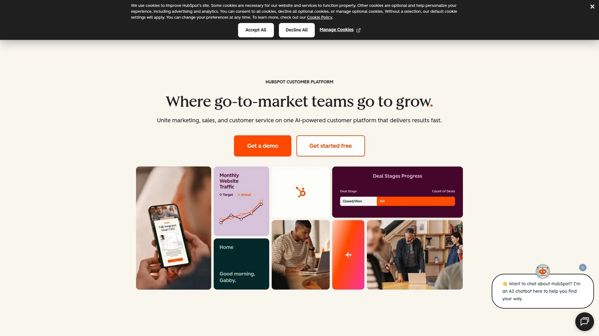

**HubSpot** is an **all-in-one digital marketing platform** known for connecting every part of your business – from marketing campaigns to sales and customer service – in one system. It combines robust **marketing automation** tools (email campaigns, social scheduling, SEO, ads) with a built-in **CRM**, so all your customer data and interactions stay in sync. You can create landing pages, blog posts, and emails all within HubSpot’s editor, and then set up **automated workflows** that nurture leads or trigger follow-ups based on behavior. Teams love HubSpot for its cross-team visibility – sales reps can see marketing touchpoints, and marketers can see sales outcomes. There’s a free CRM and basic marketing tools to get started, with premium tiers adding advanced features. While HubSpot is **highly scalable** (used by many startups up to enterprises), be mindful of cost as your contact list grows – advanced functionality comes at a premium. Overall, HubSpot excels at providing a **unified ecosystem** where **every customer interaction** – from a marketing email to a sales call – is tracked and optimized in one place. For businesses that need **complete alignment between marketing and sales**, HubSpot is hard to beat.

## [Kartra](https://kartra.com) – All-In-One Funnels, Marketing Automation & Memberships

*Premium all-in-one platform for building funnels, managing campaigns, and selling digital products.*

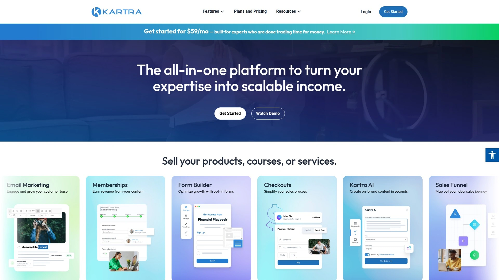

**Kartra** is a comprehensive platform that includes **landing page and funnel builders**, email marketing automation, CRM, membership site hosting, video hosting, and e-commerce features. It’s built with digital entrepreneurs in mind – coaches, course creators, and online businesses can run almost every aspect of their marketing and sales from Kartra. The **drag-and-drop funnel builder** lets you design multi-step sales funnels with upsells and downsells. Kartra’s **email automation** and tagging system make it easy to send personalized follow-ups and build complex sequences. A standout feature is its **membership portal** capabilities, which allow you to create and sell online courses or gated content with ease. It even has a built-in **affiliate management system** to help you run your own affiliate program (useful if you enlist partners to promote your products). Other perks include **video hosting** (with video analytics) and a helpdesk/ticket system to support your customers. Kartra provides **analytics** at each step of your funnels, so you can track conversions and tweak performance. While it’s on the **higher end of pricing** (starting around $99/month and up), users appreciate the **all-inclusive convenience** – instead of patching together 5–6 tools, Kartra offers a one-stop shop for serious marketers looking to scale their online business.

## [ClickFunnels](https://clickfunnels.com) – Renowned Funnel Builder for Lead & Sales Conversion

*Popular funnel-building platform focused on driving conversions, now with expanded marketing features.*

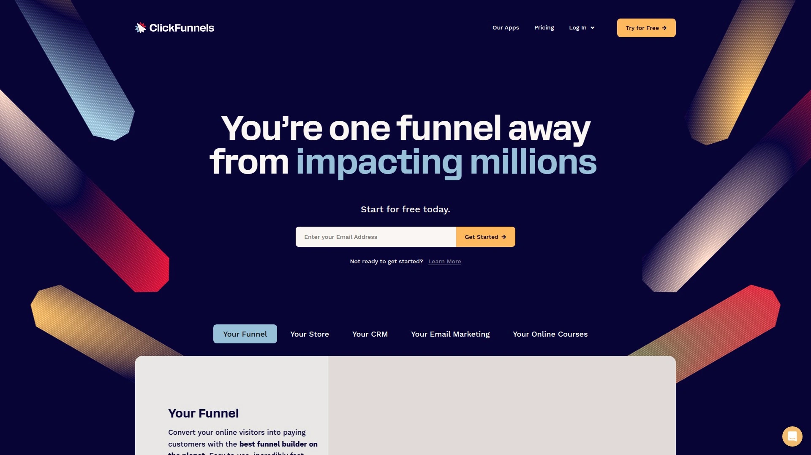

**ClickFunnels** is a **renowned marketing platform** specializing in creating high-converting sales funnels. Entrepreneurs and small businesses love ClickFunnels for its **laser focus on funnel design** – it provides dozens of pre-built funnel templates for everything from lead generation to product launches. Using the **drag-and-drop editor**, you can build landing pages, sales pages, order forms, and membership areas without coding. ClickFunnels 2.0 (the latest version) has expanded features, including a **blog builder**, e-commerce store capabilities, and even basic email automation, making it more of an all-in-one solution than its earlier version. It also supports running **membership sites** and online courses inside your funnels. For marketing automation, ClickFunnels offers a visual workflow builder to set up **email sequences** (though full email functionality is in higher plans). One of its strengths is the supportive community and extensive training resources available – funnel “cookbook” blueprints, tutorials, and an active user base to help newcomers. Do note that ClickFunnels can be **pricey** (the basic plan is around $97/month) and the design style of its templates is sometimes overly “salesy” out-of-the-box. However, if your main goal is to **build and optimize sales funnels quickly to boost conversions**, ClickFunnels remains a top choice with its battle-tested funnel frameworks and integration of key tools (A/B testing, one-click upsells, cart, etc.) into one package.

## [Systeme.io](https://systeme.io) – Budget-Friendly All-in-One for Funnels, Emails, and Courses

*User-friendly platform for funnels, email marketing, and online courses – with generous free plan.*

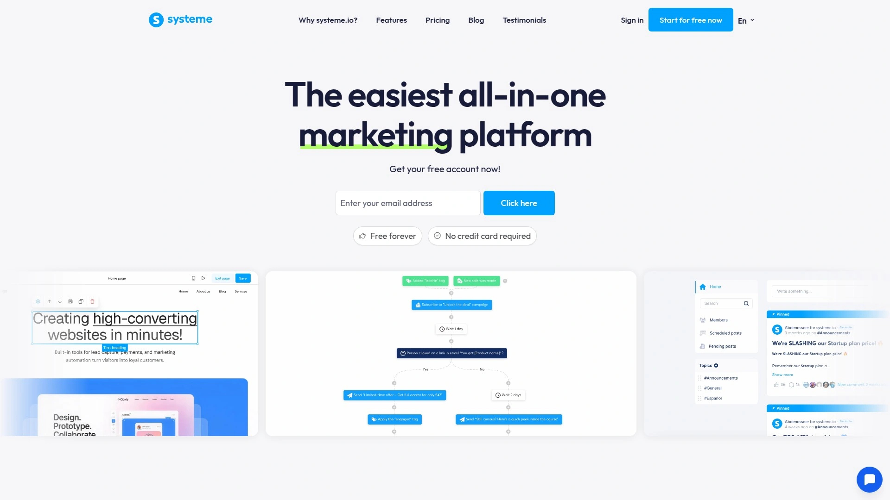

**Systeme.io** is a **comprehensive all-in-one solution** for entrepreneurs to create sales funnels, run email campaigns, host webinars, and even build membership sites. It offers an impressive range of functionality at a very affordable price point – in fact, it’s the only platform in this list that has a **forever-free plan** with basic funnel and email capabilities. With Systeme.io, you can design **squeeze pages and sales funnels** using pre-built templates and a simple editor, set up **autoresponder emails**, and sell products or courses online without needing other software. It also includes tools for **blogging**, so you can manage content marketing within the platform. Users appreciate how **beginner-friendly** Systeme.io is – it’s built to be straightforward for non-techies, with a clean interface and pre-configured templates that guide you in launching funnels quickly. Despite its simplicity, it still covers key needs: you can create unlimited email campaigns, automate sequences, host evergreen webinars, and even manage your own affiliate program for your products. **Competitive edge:** Systeme.io is known for its **affordability and value** – paid plans cost a fraction of many competitors, yet you get essential features like **unlimited emails** and automation, making it a favorite for small businesses on a tight budget. If you want to launch an online business with **minimal overhead**, Systeme.io provides the necessary tools (funnels, email, courses, e-commerce) in one place without the usual high price tag.

## [ActiveCampaign](https://www.activecampaign.com) – Powerful Email Automation with CRM & Landing Pages

*All-in-one email marketing and automation platform, now with landing pages and CRM built-in.*

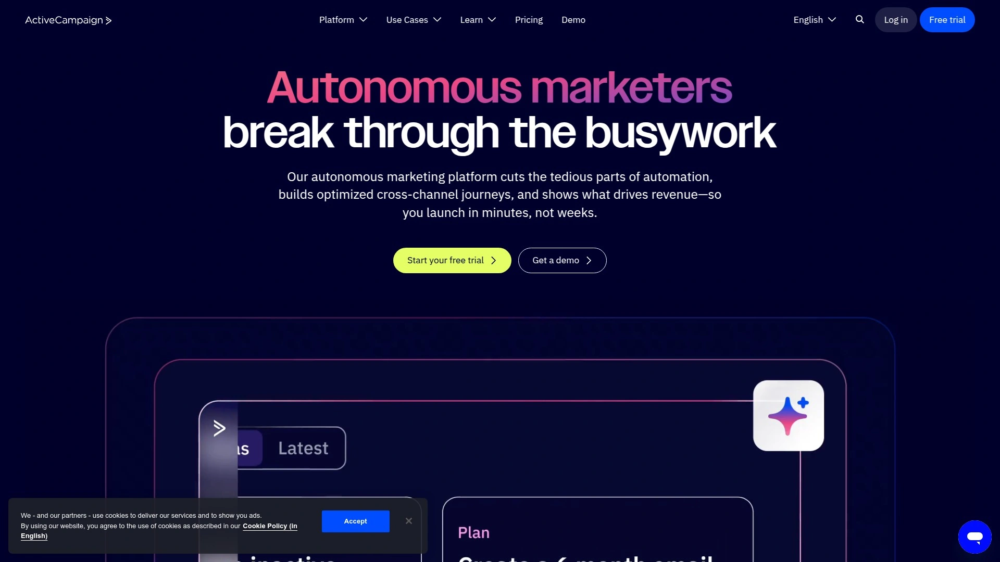

**ActiveCampaign** is widely known as an **email marketing automation service**, but it goes beyond newsletters – it offers a full suite to build **high-converting marketing funnels**. ActiveCampaign provides all the tools needed to **collect leads and nurture them** through to purchase. Its standout feature is a very **advanced automation builder**: you can visually map out email sequences, tagging, if/then logic, and even sales pipeline updates in response to customer actions. The platform includes an **easy-to-use form builder** to capture leads on your site, along with a library of landing page templates for creating opt-in pages or product pages. It also has a built-in **CRM for sales**, so your sales team can manage deals and contacts (with features like lead scoring and task assignments) in the same system that’s sending marketing emails. ActiveCampaign integrates with payment processors like Stripe, letting you handle transactions or track purchases for e-commerce automation. While it doesn’t natively host membership sites or webinars, it connects easily to other tools for those needs. Many small businesses find ActiveCampaign’s feature set **“just right”** – it’s **more advanced in automation** than beginner tools, but still accessible and **moderately priced**. The only notable omissions are that it doesn’t run things like your website or a full funnel visualization out-of-the-box (it’s more focused on communications and customer management). Overall, if **email marketing is at the heart** of your strategy and you want **CRM + landing pages + automation** together, ActiveCampaign is a top pick for its reliability and depth of features in automating customer journeys.

## [GetResponse](https://www.getresponse.com) – All-in-One Marketing Tool with Funnels, Email & Webinars

*Feature-rich marketing platform combining email, funnels, webinars, and even e-commerce tools.*

**GetResponse** has evolved from an email marketing service into one of the **most complete all-in-one solutions** on this list. Its unique **Conversion Funnel** (formerly called Autofunnel) feature allows you to set up an entire funnel workflow – from social media ads to landing pages, email sequences, and even webinars – all inside GetResponse. In practice, you can drive Facebook or Instagram ad traffic to a GetResponse landing page, capture signups, then nurture them with an automated email series, and finally convert sales through built-in e-commerce integrations or webinar sign-ups. Few platforms incorporate **webinar hosting** like GetResponse does, which is a big plus if your sales process involves webinars or live events. For e-commerce folks, GetResponse lets you **sell products** directly (it has a simple cart and integrates with payment processors) and even **recover abandoned carts** via email. The platform also added an **AI-driven website builder** recently, further pushing into “all-in-one” territory. Other highlights include a robust **email marketing suite** (with great deliverability and a new AI subject line generator), **multichannel automation** (email, SMS, push notifications), and **list growth tools** like forms and pop-ups. There’s even a feature to create and sell online courses/memberships on some plans. While the interface can feel complex given the breadth of features, GetResponse is essentially a **one-stop marketing department** – suitable for small businesses and solopreneurs who want **funnels + email + webinar** capabilities without patching together different apps. Pricing is based on contact list size; it’s reasonable for smaller lists, but can climb as your list grows. All in all, GetResponse stands out for its **versatility** – you can run campaigns across multiple channels and stages of the customer journey from one convenient platform.

## [Brevo (Sendinblue)](https://www.brevo.com) – Multichannel Marketing with Email, SMS, CRM, and More

*Affordable marketing platform with email & SMS campaigns, simple CRM, and transactional messaging.*

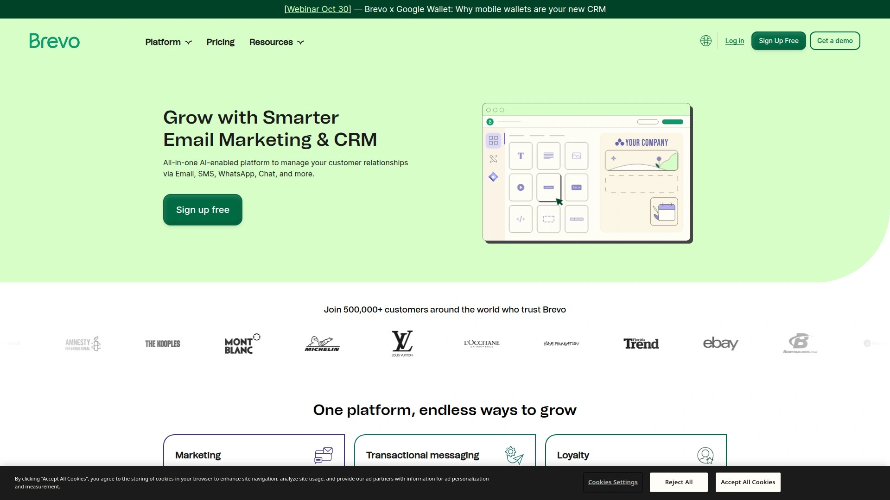

**Sendinblue**, recently rebranded as **Brevo**, is an **email marketing platform that provides all your marketing and sales tools under one roof**. It offers a full toolbox for **digital marketing**: you can send email newsletters, set up **automated email sequences**, and also run **SMS marketing** campaigns from the same dashboard. Brevo includes a lightweight **CRM** to keep track of contacts and deals, which is handy for small teams that need basic customer management. One of its strengths is **transactional email** capability – if you run an online store or app, Brevo can send order confirmations, receipts, and real-time messages reliably (they excel in deliverability). The platform also features a **drag-and-drop landing page builder** and signup forms, so you can capture leads on custom pages. For those advertising on Facebook, Brevo lets you create Facebook Ads directly within the platform to retarget contacts or reach new audiences. Additionally, you get useful analytics like real-time reporting, heat maps for emails, and A/B testing to optimize campaigns. **Why choose Brevo?** It’s particularly appealing for **small businesses** because of its **generous free plan** (up to 300 emails per day) and **low-cost paid plans** that aren’t based on number of contacts – you can have unlimited contacts, and pricing is based on email volume. This makes it cost-effective as your list grows. In summary, Brevo (Sendinblue) is a **multichannel marketing workhorse**: it may not have advanced funnel builders or course hosting, but for **email/SMS marketing, simple automation, and customer tracking**, it covers all the bases in an easy-to-use, budget-friendly package.

## [Wishpond](https://wishpond.com) – Lead Generation & Marketing Automation Platform

*User-friendly platform for landing pages, contests, pop-ups, and email automation – great for lead gen.*

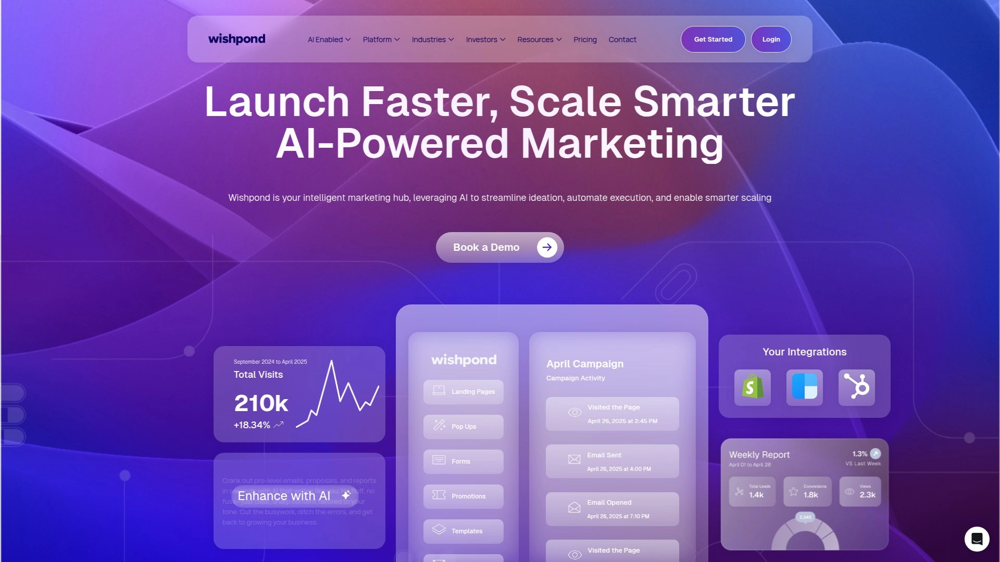

**Wishpond** is an easy-to-use **marketing platform** that focuses on **lead generation and engagement**. It allows you to create attractive **landing pages**, pop-up forms, and even run **social media contests/giveaways** to grow your audience. What makes Wishpond stand out is how approachable it is for non-designers – there’s a wide range of modern, eye-catching templates (for landing pages, sweepstakes, quizzes, etc.) that you can set up quickly without coding. Once you’ve captured leads, Wishpond takes care of **email marketing and automation**: you can send drip email campaigns, segment leads based on their activity, and use automation workflows with conditions and triggers. It’s not as complex as some others (which can be a benefit if you need simplicity), but it covers the essentials: for example, you can **A/B test** your emails or landing pages to see what performs better. Wishpond also plays well with other tools – if you already use Mailchimp or ActiveCampaign for emails, Wishpond can integrate with those, so you can use its landing page/contest tools in conjunction with your existing email service. This platform is especially useful for **marketing agencies or small businesses** that run a lot of promotions, as it supports multiple client accounts and provides an agency dashboard in higher plans. While it may lack a visual funnel map, Wishpond’s strength is **rapid deployment of lead-gen campaigns**. In short, if your focus is on **growing leads and engaging them through creative landing pages and automated emails**, Wishpond offers a convenient all-in-one solution to do so without needing technical skills.

## [Kajabi](https://kajabi.com) – All-in-One Platform for Courses, Coaching, and Memberships

*Premier platform for creating and selling online courses, with built-in marketing and website tools.*

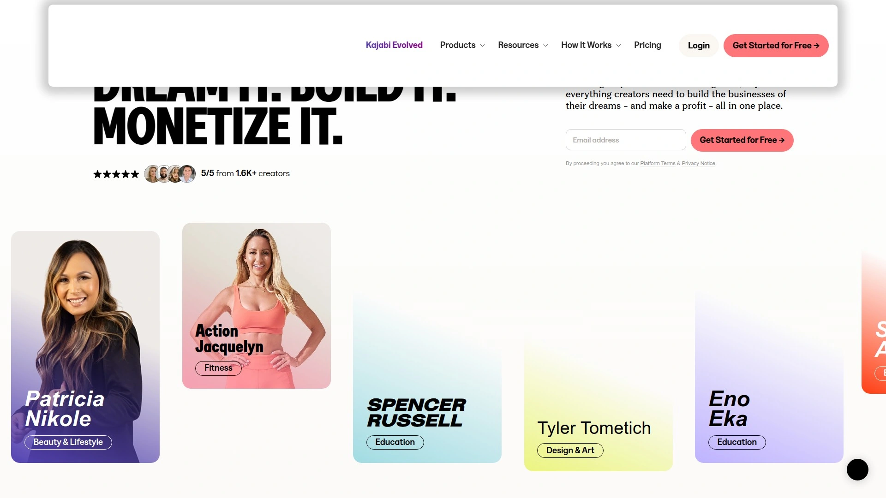

**Kajabi** is an online platform with an **impressive set of tools for creating, marketing, and selling digital products and online courses**. It’s a favorite among course creators, coaches, and membership site owners because it provides everything needed to build a knowledge business in one place. With Kajabi, you can **create online courses** with an intuitive course builder, design your members’ area, and even host **community discussions** or coaching programs. On the marketing side, Kajabi includes **landing page builders and funnel templates** to promote your offerings – for example, you can set up an opt-in page for a webinar, a sales page for your course, and a checkout page, all coordinated within Kajabi. It also handles **email marketing**, allowing you to send newsletters or automated sequences (like a welcome series for new sign-ups) right from the platform. What sets Kajabi apart is the seamless integration between content and marketing: when someone signs up for your course, Kajabi can automatically subscribe them to an email sequence, tag them for upsell campaigns, etc., without third-party tools. There’s also **podcast hosting** and the ability to build a **mobile app** for your content – illustrating how Kajabi goes beyond just courses. While Kajabi is on the pricier side (no free plan; entry plans around $149/month), it eliminates the need to duct-tape a website, a course platform, an email service, and a shopping cart together. It’s truly an all-in-one for people selling expertise. If you are a **knowledge entrepreneur** who wants to focus on content and marketing rather than tech, Kajabi provides a reliable, professional-grade hub to do it all – from website to course delivery to email funnels.

## [Ontraport](https://ontraport.com) – CRM + Marketing Automation Suite for Growing Businesses

*Robust all-in-one CRM and marketing automation software, ideal for service businesses and advanced workflows.*

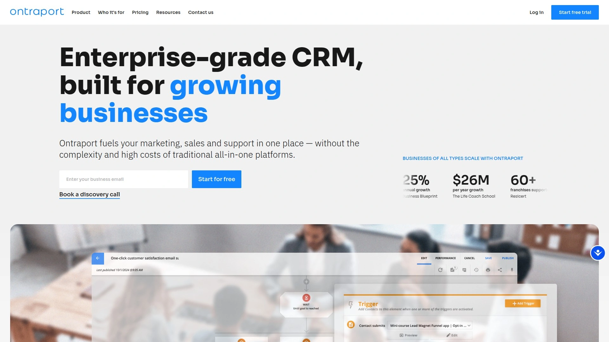

**Ontraport** is an **“all-in-one” business automation platform** that combines a powerful **CRM**, **sales pipeline management**, and **marketing automation** in one package. It’s designed to handle the majority of your business processes – whether you’re running a B2B service, an e-commerce brand, or are a busy solopreneur, Ontraport provides tools to manage everything from lead capture to client follow-up. At its core, Ontraport includes a **fully customizable CRM** database where you can tailor contact fields and pipelines to your needs. The marketing side includes a **visual campaign builder** for automating emails, SMS, tasks, and more based on triggers (it’s very flexible, allowing complex multi-step workflows). Ontraport also features **landing page and form builders**, so you can create opt-in pages or even a simple website. Uniquely, it has **built-in payment processing and e-commerce capabilities** – you can sell products or subscriptions, and Ontraport will handle payments, apply tags, and even manage a **membership site** if you have gated content. Essentially, it can run your **entire customer lifecycle**: generate leads (pages/forms), nurture them (email/SMS automation), convert sales (CRM deals and payments), and fulfill with memberships or follow-up sequences. Ontraport also supports **postcard marketing** and other nice touches. It’s especially popular with small businesses that need **advanced automation** but want to avoid enterprise software complexity. Keep in mind, the learning curve is a bit steeper than entry-level tools, given how much you can do. However, many entrepreneurs find that Ontraport’s all-in-one approach **saves money** and reduces tech headaches in the long run (no more duct-taping a CRM + email tool + cart + membership plugin, etc.). If you want a **single system to automate your business** from end to end, Ontraport is a compelling choice with a decade-plus track record.

## [Keap](https://keap.com) (Infusionsoft) – Complete CRM & Marketing Automation for Small Biz

*Small-business CRM known for its powerful automation, sales pipelines, and integrated email marketing.*

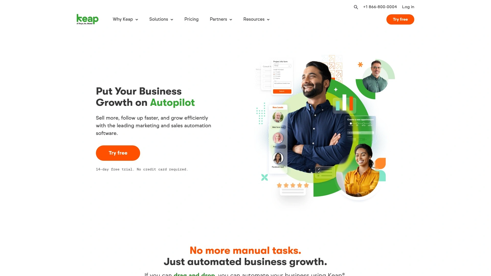

**Keap** – formerly Infusionsoft – is a long-standing **all-in-one CRM and marketing automation platform** aimed at small businesses. It offers a blend of **contact management**, **email & SMS marketing**, **sales pipeline** management, and **e-commerce** capabilities in one system. Keap helps entrepreneurs capture new leads (via custom forms or landing pages), then automatically follow up and nurture those leads using its campaign builder. You can create sophisticated **automation workflows** that send emails or texts, apply tags, create tasks for your team, and more based on triggers (like a form filled, an appointment scheduled, or a purchase made). All plans include core features like **CRM, email marketing, appointments, quotes, and analytics**, while higher tiers add more advanced automation and customization. One of Keap’s strengths is the **visual pipeline** for sales – you can track leads and deals through stages, which is great for service businesses that need to manage consultations or proposals. It also has a **built-in payment system**, so you can send invoices or take payments online, and the system will log everything to the contact record. For marketing, Keap’s **email builder** and templates are straightforward to use, and you can segment contacts easily for targeted campaigns. The **learning curve** has improved over the years (Infusionsoft was infamous for complexity, but Keap’s newer interface is more user-friendly). Do note that Keap is relatively **premium-priced** (starting around $129/month for the basic tier and going up with more contacts), and it’s best for those who intend to use both the CRM and automation heavily – if you only need simple email newsletters, it might be overkill. In summary, Keap is ideal for **small businesses that require both a CRM and robust marketing automation in one** – for example, a coaching practice or an agency that needs to track clients and automate follow-ups in a single system, rather than using separate apps.

## [Groove.cm](https://groove.cm) (GrooveFunnels) – Suite of Online Business Tools with Lifetime Option

*Ambitious all-in-one platform including funnel builder, email marketing, e-commerce, and more (some features still evolving).*

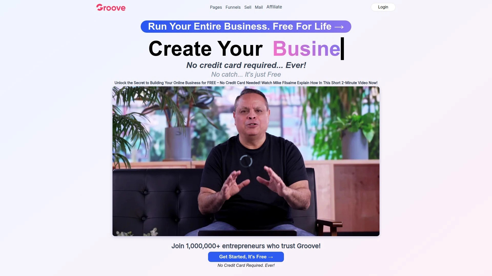

**Groove** (also known as GrooveFunnels or Groove.cm) is a suite of online marketing tools designed to help businesses manage various aspects of their online presence – including **website building, sales funnels, email marketing, and even webinars and e-commerce**. It launched in 2020 as a high-promise platform bundling many functions under one roof. The core of Groove is **GroovePages**, a funnel and website builder with a drag-and-drop editor to create landing pages, sales funnels, and full websites. For email marketing, there’s **GrooveMail**, which lets you set up campaigns and automated sequences much like dedicated email tools. Groove also includes **GrooveSell** and **GrooveKart** for selling products – covering digital sales and even full storefronts for print-on-demand or physical products. Unique offerings in Groove’s suite are **GrooveWebinars** (for live and automated webinars) and **GrooveVideo** (a video hosting service with marketing-oriented features). They even have **GrooveAffiliate** to manage your own affiliate programs if you want to recruit affiliates for your products. The appeal of Groove is having all these interconnected tools without monthly subscriptions – they famously offered a **Lifetime deal** for early adopters. In terms of user experience, Groove has a modern interface and plenty of features, but some users note that certain features have been slow to mature or that there’s a learning curve as the ecosystem is so broad. However, continuous updates are being made. For marketers who want a **one-login solution** covering everything (and who are willing to be patient with a few growing pains), Groove provides tremendous value – especially if you secured the lifetime access. It’s particularly interesting for those who utilize **webinars and video marketing** as part of their funnels, since those tools are built-in. If fully realized, Groove aims to replace a dozen separate subscriptions (page builder, email service, cart, etc.), making it a potential game-changer for digital entrepreneurs seeking an all-encompassing platform.

## [Mailchimp](https://mailchimp.com) – Popular Email Marketing Platform with All-in-One Features

*Email marketing leader that now offers a broader marketing platform (landing pages, e-commerce, and more).*

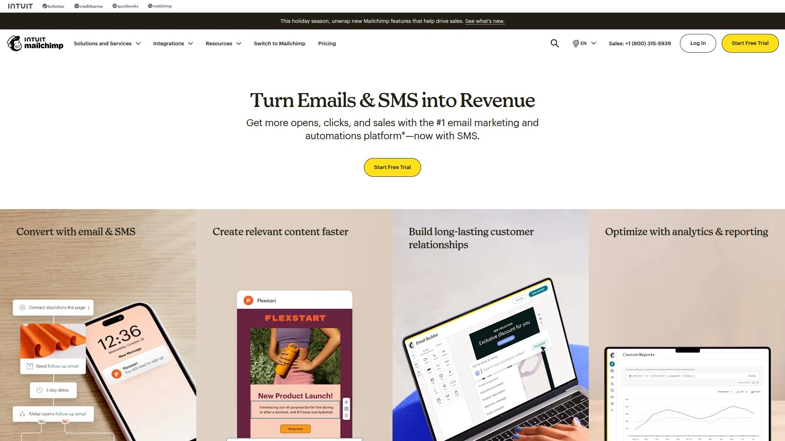

**Mailchimp** is often the first name that comes to mind for email newsletters, but it brands itself as an **“All-in-One Marketing Platform”**, aiming to consolidate various marketing functions for small businesses. With Mailchimp, you of course get a reliable **email marketing service** – easy drag-and-drop email designer, audience segmentation, and scheduling – but in recent years they have added many tools: a **landing page builder**, basic **website builder**, and even an e-commerce storefront option for selling products (with integrations to payment gateways). This means a small business could theoretically host a simple website or landing pages and run email campaigns all from Mailchimp. They also offer **social media posting and ad management** from the dashboard, allowing you to create Facebook or Instagram ads and track results. Additionally, Mailchimp has built-in **CRM-like features**, where you can manage contacts, tag them with attributes, and view a combined contact profile with their interactions. While Mailchimp’s automation is not as advanced as some dedicated platforms, you can still set up **customer journeys** (multi-step drip campaigns based on triggers like signups or purchases) to nurture leads. One standout is Mailchimp’s generous **Free plan**, which has long been popular – it allows smaller senders to use core email features at no cost (until your list grows beyond a certain point). This makes Mailchimp an attractive starting point for new businesses. The trade-off is that Mailchimp can be a bit **limited or inflexible** in advanced automation, and pricing can jump once you move to paid tiers or have a large list. Overall, for a **small business or creator just starting out**, Mailchimp offers an approachable all-in-one marketing toolkit – you can get a website online, start capturing emails, and send campaigns without needing a bunch of separate services. As your needs grow, you might outgrow it, but Mailchimp remains a solid launchpad with one of the friendliest user experiences in the industry.

## [Constant Contact](https://constantcontact.com) – Digital Marketing Suite for Small Businesses

*Small-business marketing platform combining email, social, and website building with an emphasis on ease of use.*

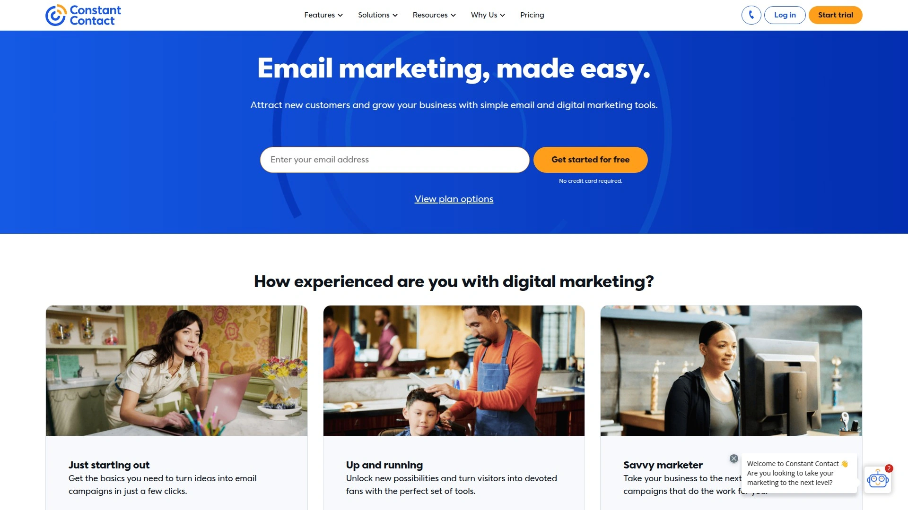

**Constant Contact** has long been known for email marketing, but it has expanded into a broader **digital marketing platform for small businesses**. Its goal is to make online marketing easy for beginners. With Constant Contact, you get a dependable **email marketing tool** (with hundreds of templates, a drag-and-drop editor, and support for features like surveys and event invitations), plus additional goodies like a **social media scheduler** and even an **SMS marketing** add-on. Notably, Constant Contact includes a **website builder** in its toolkit – a simple AI-powered site builder that can create a basic website or landing pages for you, which is great for small businesses without a site. It also has **e-commerce capabilities**: you can set up an online store, manage a product catalog, and send abandoned cart emails if you connect it with their e-commerce integrations. For capturing new leads, Constant Contact provides forms and even text-to-join options. One niche feature is the ability to promote and manage events (including collecting RSVPs or selling event tickets through their platform), which is handy for nonprofits or event organizers. In terms of **marketing automation**, Constant Contact is on the simpler side – you can schedule automated welcome emails or birthday emails, etc., but it’s not a full-blown workflow builder like some others. The appeal here is really the **approachability**: Constant Contact offers a lot of guidance, live support, and pre-made marketing plans to help small business owners who may not be tech-savvy. It’s a **paid platform with tiered pricing** based mainly on list size (no free plan beyond a short trial). If you are a **local business, nonprofit, or sole proprietor** looking for a one-stop marketing solution (website + email + some social) that’s straightforward to use, Constant Contact fits that profile well – it covers the marketing essentials without overwhelming you with complexity.

## [Zoho Marketing Plus](https://www.zoho.com/marketingplus/) – Integrated Marketing Suite in the Zoho Ecosystem

*Integrated marketing platform unifying email, social, events, and analytics – part of Zoho’s all-in-one business ecosystem.*

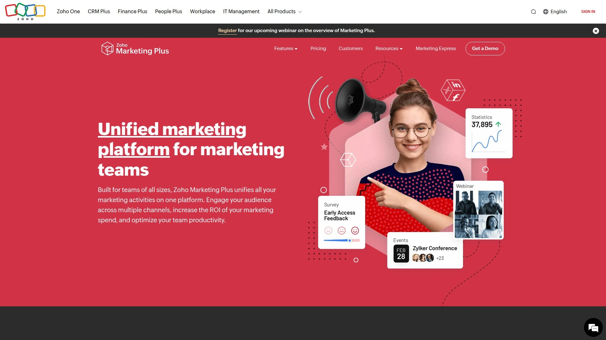

**Zoho Marketing Plus** (from Zoho’s extensive suite of business apps) is an **all-in-one marketing hub** that brings together multiple channels and tools under one roof. Zoho is known for offering everything from CRM to accounting to project management, and with Marketing Plus, they specifically unify marketing functions. Within this platform, you can manage **email campaigns**, social media posting, SMS, webinars, and even surveys, all linked to a central campaign calendar. It also includes a **marketing automation** module where you can create workflows to nurture leads or engage customers across channels (for example, an automated sequence might send an email, then a follow-up SMS, then assign a lead to sales). One handy aspect is the **brand studio/dashboard** which gives a bird’s-eye view of all campaigns and their performance, ensuring that your messaging is consistent. Zoho Marketing Plus also ties into **Zoho CRM** seamlessly – marketers can see CRM data and segment or trigger actions based on sales info, and sales teams see marketing touchpoints. For content creation, you have a document hub for collaborating on collateral. If you run events, Zoho Marketing Plus can integrate Zoho Backstage (for event management), so your webinars or conferences become part of your marketing mix in the same system. The platform offers **analytics and ROI tracking**, so you can attribute leads and revenue to various campaigns easily. Since it’s part of the Zoho family, it’s particularly attractive for those already using Zoho’s other software (like Zoho CRM or Zoho Commerce), as it completes the all-in-one experience. However, even on its own, Marketing Plus is a cost-effective solution (Zoho is known for reasonable pricing) for mid-sized businesses that want a **centralized marketing command center**. It might not have specialized funnel builders like some competitors, but as a **broad marketing suite**, especially if you value integration with CRM and other business tools, Zoho Marketing Plus is a strong contender that continues to grow in capabilities.

## [HighLevel](https://gohighlevel.com) – All-in-One Platform for Agencies (White-Label Ready)

*Comprehensive marketing and CRM platform designed for agencies – includes funnels, SMS, reputation management, and more.*

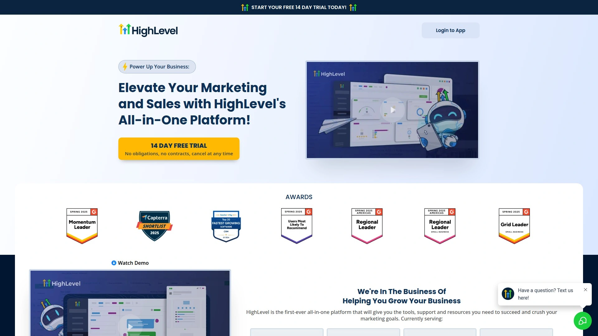

**HighLevel** (GoHighLevel) is an **all-in-one marketing and CRM platform** specifically tailored for digital agencies and marketers who serve clients. It bundles together a wide array of tools: you get a **funnel builder** (similar to ClickFunnels style drag-and-drop for landing pages and websites), a full **CRM** to manage leads and pipelines, **email marketing**, **SMS texting**, inbound phone call tracking, appointment scheduling, and even features like surveys and forms. HighLevel’s philosophy is to replace the patchwork of software an agency might use for clients (email automation, text message tools, booking calendars, etc.) with one unified app. For example, a local business client could have their **website landing pages**, their **Google/Facebook ad lead forms**, and their **follow-up campaigns** (text messages and emails) all running through a HighLevel account managed by the agency. It also includes **reputation management** – pulling in Google and Facebook reviews and allowing you to request reviews – which is great for local businesses. A standout feature of HighLevel is the ability to **white-label** it: agencies can brand the platform as their own and even resell accounts to clients. They also provide a membership area feature for hosting courses or content, and integrations to popular tools and social platforms for posting. HighLevel’s **automation builder** is very powerful – you can visually create workflows that handle multi-channel communication and lead routing (e.g., when a new lead comes in, automatically send a text, then an email, create a CRM deal, alert a team member, etc.). Because it’s so feature-rich, HighLevel can feel complex initially, but it’s incredibly flexible. Pricing is also unique – it’s a flat monthly fee for the agency (unlimited sub-accounts), which can be highly cost-effective if you manage multiple projects. In summary, for **agencies, marketers, or freelancers** who manage marketing funnels and communications for various clients (or for a sophisticated in-house marketing team), HighLevel provides an **all-in-one powerhouse** that centralizes client marketing operations and can even become a new revenue stream via its white-label capabilities.

## [Thrive Suite](https://thrivethemes.com/thrive-suite/) – Conversion-Focused WordPress Toolset (Websites & Funnels)

*All-in-one conversion toolkit for WordPress users – build sites, pages, pop-ups, and funnels with a suite of plugins.*

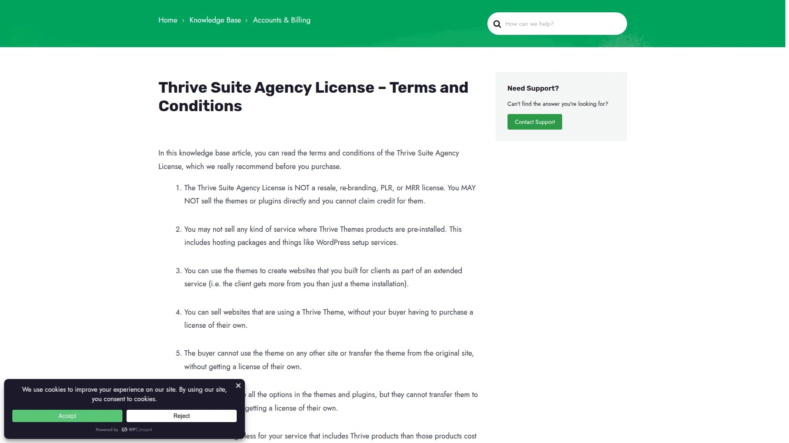

**Thrive Suite** is a bit different from others on this list: it’s an **all-in-one package of WordPress plugins** that turn a WordPress site into a powerful marketing machine. If you use WordPress for your website, Thrive Suite provides all the critical marketing functionality via its tools – including **Thrive Theme Builder** (for your site design and templates), **Thrive Architect** (a drag-and-drop landing page and content builder), **Thrive Leads** (advanced opt-in forms and pop-ups with A/B testing), **Thrive Quiz Builder**, **Thrive Ultimatum** (for scarcity campaigns and countdown timers), and even **Thrive Apprentice** (for creating online courses/membership content within WordPress). Essentially, Thrive Suite covers **website building, landing page & funnel creation, lead generation, and even course delivery** – all integrated seamlessly into WordPress. This is ideal for marketers who prefer owning their platform (WordPress) and want full control. With Thrive’s tools, you can design high-converting pages and funnels on your own domain, run email signup forms with detailed targeting and triggers, and create quizzes or surveys to engage users. It’s important to note that Thrive Suite does **not include an email service or CRM** – rather, it focuses on the on-site conversion elements and integrates with your email marketing service of choice via API. For example, you’d capture leads with Thrive Leads and send them into Mailchimp, ActiveCampaign, etc., for follow-up. Thrive Suite is sold as a **subscription (around $30-$90/month depending on billing cycle) for all plugins on up to 25 sites**, which is quite economical given the range of tools. The **conversion-focused approach** is what shines – every feature is about boosting signups, sales, and engagement on your site. If you are comfortable with WordPress and want an **all-in-one marketing toolkit that lives on your website** (with no limitations on leads or pages since it’s self-hosted), Thrive Suite is an excellent solution. It’s especially popular among bloggers, course creators, and small businesses who want **full ownership of their funnel infrastructure** without sacrificing functionality.

## [Unbounce](https://unbounce.com) – Landing Page & Conversion Platform with Smart AI Features

*Leading landing page builder with AI optimization – great for creating and testing campaign pages quickly.*

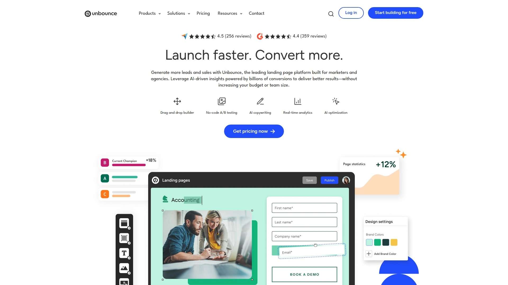

**Unbounce** is a top-notch platform for **building landing pages and optimizing conversions**, often used alongside broader marketing tools. While it’s not a full marketing suite with email or CRM, it’s frequently included in “all-in-one” discussions because of how it streamlines a crucial part of marketing – creating and testing dedicated campaign pages. With Unbounce, marketers can quickly craft professional, mobile-responsive landing pages using a drag-and-drop editor or start from high-converting templates. What sets Unbounce apart is its focus on **conversion intelligence**: features like **Dynamic Text Replacement** (to tailor your page text to match a visitor’s search terms), and an AI-driven tool called **Smart Traffic** which automatically directs visitors to the variant most likely to convert, learning and optimizing as traffic comes in. Essentially, Unbounce helps you maximize leads or sales from your ad campaigns by making it easy to iterate on landing pages. It also supports sticky bars and pop-ups to capture visitors on your main website. Marketers who run paid advertising often use Unbounce to rapidly deploy pages for different ads and A/B test them without involving developers. All leads collected can be piped into your email marketing or CRM system via integrations (Unbounce connects with everything from Mailchimp to HubSpot). While Unbounce doesn’t send emails or manage contacts, it plays nicely with those that do. It’s a **specialist tool** in this lineup: if you already have an email platform but need a better way to handle landing pages and increase conversion rates, Unbounce is the go-to. It saves time and tends to pay for itself by lifting campaign performance. For a **small marketing team or startup**, using Unbounce alongside a simple email tool can effectively serve as an all-in-one solution: you’d have the front-end (Unbounce pages) and back-end (email/CRM) covered. Unbounce plans are based on features and traffic, so you can choose what fits your needs. In short, **Unbounce is recommended for marketers who value high-converting landing pages** – it’s the secret weapon to get more out of the traffic you’re driving, using smart automation and testing to boost results.

## [Leadpages](https://www.leadpages.com) – Code-Free Website and Landing Page Builder for Entrepreneurs

*Affordable platform to create websites, landing pages, and pop-ups with ease – ideal for beginners and small businesses.*

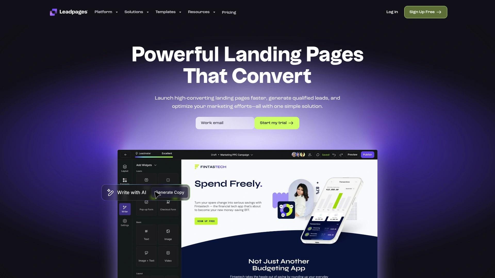

**Leadpages** is a user-friendly tool that allows entrepreneurs to **build their own mobile-responsive website and landing pages from scratch** using a simple drag-and-drop editor. It’s often praised as a great option for those just starting out because it strips away complexity and focuses on quick deployment. With Leadpages, you can spin up unlimited landing pages, pop-up forms, and alert bars to capture leads or announce promotions – all without touching code. While it doesn’t offer built-in email sending, Leadpages integrates smoothly with whatever email or CRM you’re using (e.g., Mailchimp, ConvertKit, HubSpot, etc.) to send the leads you capture into those systems. One of the best things about Leadpages is that **all plans allow unlimited leads and traffic** – unlike some platforms that charge per lead, Leadpages’ pricing is feature-based, so you won’t be penalized for growing your audience. This makes it cost-effective as your campaigns scale. Another nifty feature is their new **AI-powered content generation**: the platform can generate landing page copy, headlines, or even find relevant stock images for you, which is a boon if you have marketer’s writer’s block or lack design resources. Leadpages also provides over a hundred conversion-optimized templates and even **step-by-step guides (checklists)** for launching pages quickly, which is great for non-marketers. Essentially, Leadpages covers the **front-end marketing site/funnel needs** for a small business – you could build your main company website on it and also create dedicated landing pages for each campaign or ad, all in one tool. Its forms and pop-ups help grow your email list, and then you rely on an email service for nurturing (which is by design; Leadpages focuses on what it does best). If you’re a founder or small business owner who wants to **establish an online presence and capture leads without hiring developers**, Leadpages is an excellent, budget-friendly starting point that can grow with you until you perhaps need more advanced automation down the line.

## [Instapage](https://instapage.com) – Enterprise Landing Page & Personalization Platform

*High-end landing page platform with collaboration and personalization features – great for teams and ads at scale.*

**Instapage** is an advanced **landing page platform** geared towards marketers who demand precision and scalability in their campaigns. It enables you to create conversion-optimized landing pages with a pixel-perfect drag-and-drop builder, similar in ease to competitors, but it shines in its **collaboration and optimization capabilities**. Instapage is built to handle large-scale PPC and advertising campaigns: it offers features like **AdMap**, which helps you visualize and connect your ad campaigns to specific landing pages, ensuring a tight message match for each ad group. It also has **dynamic text replacement** (like Unbounce) to boost relevancy. One standout is **Instablocks** – a system that lets you save sections of pages (like testimonials, headers, etc.) and reuse them, which is a huge time-saver for teams building dozens of pages. Instapage also offers a unique **personalization** feature (Experiments/Personalization), where you can create variations of a page for different audiences and Instapage will automatically show the right variation based on criteria you set (like if user is in X industry, show version B). This goes beyond basic A/B testing into the realm of tailored post-click experiences. Agencies and large teams love Instapage for its **collaboration tools**: you can invite teammates or clients to comment directly on pages for feedback, making the review process much smoother. When it comes to speed, Instapage provides super fast page loading via a global CDN, which can improve your Google Ads quality scores. It integrates with all major ad networks and analytics tools, as well as CRMs and email platforms to send your new leads into the appropriate systems. The platform is priced higher than basic tools (it’s aimed at businesses that spend serious money on ads and need to maximize ROI), but if you fall into that category, the **conversion lift and efficiency gains** Instapage brings can justify the cost. In summary, for **marketing teams or agencies running high-volume campaigns**, Instapage offers an all-in-one solution to **build, personalize, and optimize landing pages at scale**, ensuring you get the most conversions for your ad spend.

## [MailerLite](https://www.mailerlite.com) – Simple Email Marketing with Websites & eCommerce

*Lightweight all-in-one marketing tool offering email, landing pages, websites, and even selling digital products.*

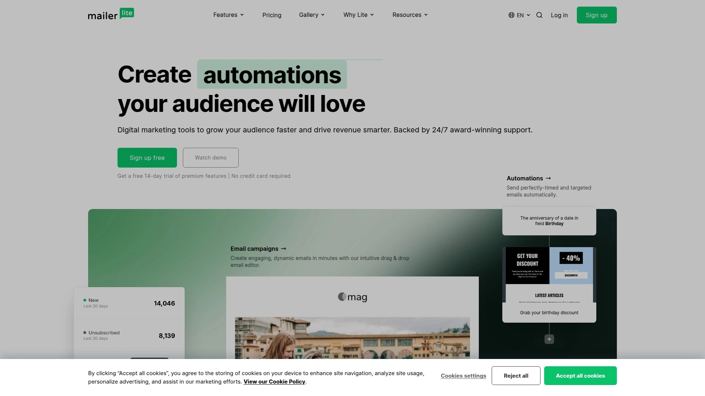

**MailerLite** is a popular **email marketing service** known for its simplicity and affordability, which has grown into a more **all-in-one platform** for small businesses and creators. In addition to its core email capabilities (which include a drag-and-drop editor, automation workflows, and a rich template gallery), MailerLite offers a built-in **landing page and website builder**. This means you can create a basic website or standalone landing pages and host them on MailerLite – a great option for those without an existing site. These pages integrate naturally with your email forms, so subscribers go straight into your MailerLite lists. Furthermore, MailerLite introduced features to **sell digital products or subscriptions**; you can upload an e-book or an online course and sell it via landing pages, handling payments through Stripe. This blurs the line into e-commerce and membership territory, giving creators a one-stop solution to monetize content. The platform includes **pop-ups and embedded forms** for lead capture, basic **CRM functionalities** (like tagging, segmentation, and even a visual subscriber journey builder in the advanced version), and **survey capabilities** to gather feedback. One reason many choose MailerLite is its **generous free tier** – it allows up to 1,000 subscribers with a substantial monthly send limit, which is perfect for new projects. The interface is often praised for being intuitive, and they have a responsive support team even for free users. While it’s not as feature-dense in automation as ActiveCampaign or as funnel-focused as ClickFunnels, MailerLite covers the fundamental needs extremely well: **build a website, collect leads, send emails, and make sales**. It’s an ideal all-in-one starter solution for **bloggers, small startups, or freelancers** who want to quickly establish an online presence and start engaging an audience, without needing to piece together multiple apps. As you grow, MailerLite’s paid plans remain very budget-friendly and they continue to add new features (recently adding things like dynamic email content and promotional pop-ups). All in all, MailerLite proves that an all-in-one marketing platform can be **simple yet effective** – perfect for those who need to get the job done without fuss.

## [Landingi](https://landingi.com) – Landing Page Platform for Campaigns and SMBs

*User-friendly landing page builder and marketing platform with templates and lead management.*

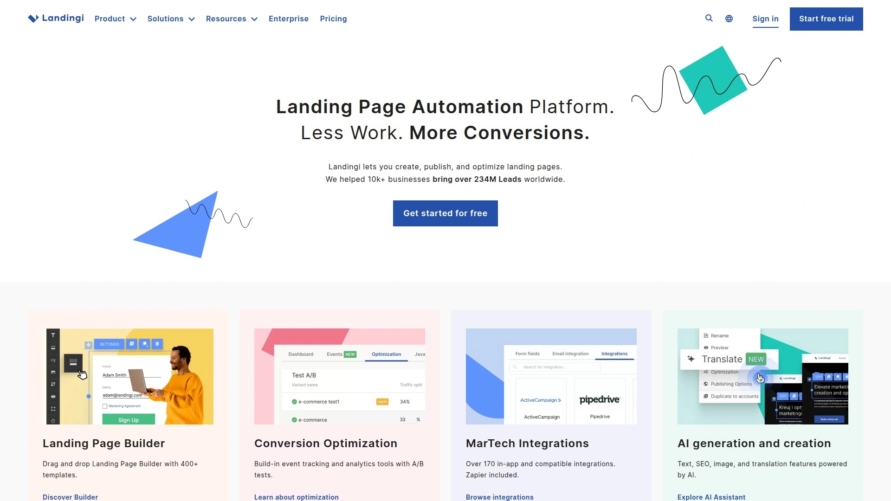

**Landingi** is a straightforward **landing page builder and conversion platform** aimed at marketers and small businesses who need to create campaign pages quickly. It provides a drag-and-drop editor with plenty of templates, enabling anyone to spin up professional-looking landing pages for promotions, events, or product launches without coding. Landingi also supports **pop-ups and alert bars**, which you can deploy on your website to capture more leads or announce sales. One useful feature is its **A/B testing** module – you can create variations of a page and test which one converts better, all within the interface. Landingi doesn’t stop at page building; it also offers a **built-in lead management** system. When someone fills out your landing page form, their data is stored in Landingi’s dashboard (and it can send you email notifications), so you can manage and export leads or integrate directly with your CRM/email tool of choice (it has native integrations and Zapier support). This is handy if you’re running multiple campaigns and want to keep track of performance per landing page. Another plus: Landingi includes **funnel capabilities** through its “microfunnels” feature – essentially you can link pages in a sequence (e.g., an opt-in page → thank-you page → upsell page) to create a simple funnel and track drop-off at each step. It also supports **custom domains**, so your pages can be under your own URL. For agencies or teams, Landingi has an Agency plan that allows workspaces for different clients and team collaboration, showing it’s geared for professional use as well. In terms of cost and learning curve, Landingi is considered quite accessible – it’s often chosen by those who find Unbounce or Instapage too pricey or complex for their needs. In summary, if you need an **efficient tool to design landing pages and capture leads** – and perhaps aren’t ready for a full-blown funnel or marketing automation system – Landingi is a reliable choice. It focuses on that critical step of converting ad clicks or visitors into leads, and it does it well, making it a valuable component of an all-in-one marketing toolkit for many small businesses.

## [SendPulse](https://sendpulse.com) – Multi-Channel Marketing Automation (Email, SMS, Chatbots, & More)

*All-in-one messaging platform combining email, SMS, web push, and chatbot marketing with a CRM.*

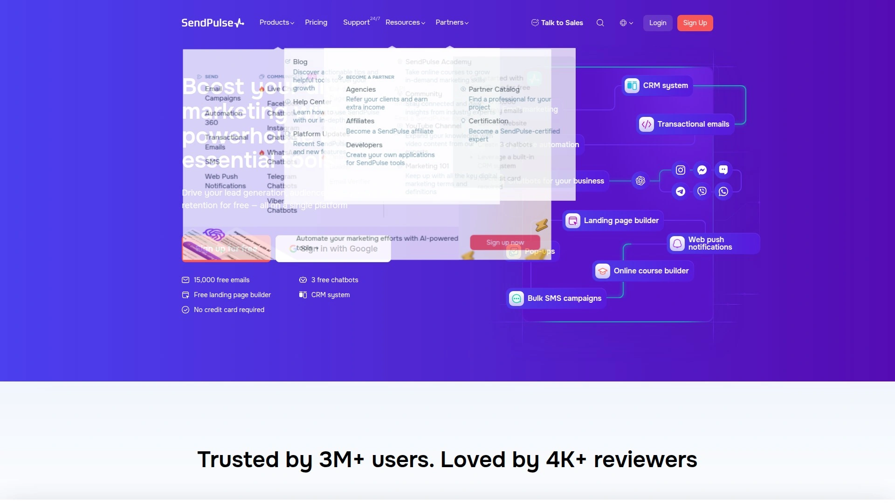  

**SendPulse** is a **multi-channel marketing automation platform** designed to help businesses engage their audience across various channels. It brings together tools for **email marketing**, **SMS messaging**, **web push notifications**, **Facebook/WhatsApp chatbots**, and even a simple **CRM**, all in one place. The idea is that you can orchestrate a campaign that might start with an email, follow up with a text message, and then engage via a chatbot – and SendPulse will manage each step. For example, you could set up an automation workflow where if a user opens an email but doesn’t click, they get a push notification the next day, or if someone signs up via Messenger, they get added to your email list with a tag. This level of integration between channels is something many other platforms don’t offer natively. SendPulse also includes a **landing page builder**, which allows you to create pages to capture sign-ups or demo requests, feeding those leads directly into the system’s CRM or mailing lists. The platform’s CRM is lightweight but useful for keeping track of leads and their journey through your funnel. Another advantage of SendPulse is its focus on **transactional messages**: you can use it to send order confirmations, password resets, or other automated service emails with high deliverability, in addition to marketing emails. They provide an API for developers to integrate these capabilities into websites and apps. SendPulse offers a free plan that covers basic email (up to a certain limit) and very affordable add-ons for SMS and extra channels. This makes it attractive to small businesses and startups that want to experiment with multi-channel marketing without breaking the bank. In essence, SendPulse is like having **several communication tools under one roof** – instead of separately managing your email service, your SMS service, and your chatbot platform, SendPulse centralizes them. If reaching your customers on **multiple platforms (inbox, phone, browser, chat)** is important to your strategy, and you want a cohesive way to do it, SendPulse is a compelling choice that keeps things convenient and synchronized.

## [SharpSpring](https://sharpspring.com) (Constant Contact Lead Gen & CRM) – Marketing Automation for Agencies

*Full-featured marketing automation and CRM platform known for agency-friendly pricing and comprehensive features.*

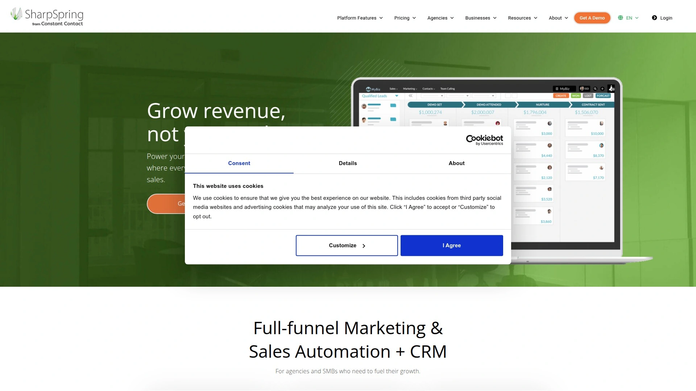

**SharpSpring** (recently acquired by Constant Contact and sometimes rebranded as Constant Contact Lead Gen & CRM) is an **all-in-one marketing automation platform with an integrated CRM**, often praised for offering **enterprise-like features at SMB-friendly pricing**. It’s a platform that provides **end-to-end marketing and sales capabilities**: you have dynamic **email marketing** with behavior-based automation, a **visual workflow builder** to design complex nurturing sequences, **blog and landing page builders** for content and campaigns, **social media management**, and a robust **CRM** to track leads, opportunities, and deals. One thing that sets SharpSpring apart is its **agency-centric focus** – they offer unlimited client accounts and allow agencies to white-label the platform, making it a popular alternative to pricier solutions like HubSpot for marketing agencies. SharpSpring’s email and automation tools allow deep personalization; you can do things like score leads based on engagement, trigger automations when a lead visits a particular page on your site, or even adjust content shown on your website or emails based on a lead’s attributes (dynamic content). It also has a built-in **landing page and form builder**, which can replace tools like Unbounce if you don’t need extremely advanced design. Another highlight is **campaign tracking and ROI reporting** – SharpSpring ties the whole funnel together, showing you which campaigns (email, ads, etc.) are driving leads and revenue, which is invaluable for optimization. They even include an **integrated call tracking** feature to capture phone leads. In terms of user experience, SharpSpring might require a bit more onboarding effort than some simpler tools, but it’s highly capable once you get the hang of it. Many companies choose SharpSpring as a more affordable alternative to HubSpot or Marketo, since it offers **similar functionality (CRM + marketing automation + analytics)** often at a flat rate not dependent on number of contacts, which can be cost-saving. If you’re a **business or agency that needs a complete funnel system** – from attracting leads to closing sales – and you want a **unified database for marketing and sales**, SharpSpring is definitely one to consider. It delivers a lot of bang for the buck and has a strong reputation among agencies for its partnership approach.

---

## FAQ: All-in-One Marketing Platforms

**Q1: Can I really replace all my other marketing tools with an all-in-one platform?**
**A1:** It depends on your needs, but **yes**, that’s the goal. Top all-in-one platforms provide a website/funnel builder, email marketing, automation, and CRM in one. You may not need separate tools for those functions. Evaluate each platform’s features to ensure they cover everything you use (for example, if you need advanced analytics or a specific feature like webinars, check that it’s included). Many businesses find they can consolidate **multiple subscriptions into one** with the right platform, simplifying management and reducing costs.

**Q2: Which all-in-one platform is best for beginners or small businesses?**
**A2:** For small teams or beginners, look for platforms that are **easy to use and offer strong support**. **[Builderall](https://builderall.com)** is a great choice for its intuitive builders and affordable plans tailored to entrepreneurs. Also, **Systeme.io** and **MailerLite** have free plans and simple interfaces ideal for starting out. These options let you experiment with building funnels, sending emails, etc., without a steep learning curve or big budget.

**Q3: Do all-in-one platforms support creating sales funnels without coding?**
**A3:** Absolutely. A core feature of these platforms is **drag-and-drop funnel or page builders**. You can select a template, customize text and images, and publish – no coding required. Platforms like ClickFunnels, Kartra, and Groove are specifically built around funnel creation. Even more general ones like HubSpot or Keap offer visual campaign builders to map out your funnel steps. So, you can definitely build complete sales funnels (landing page → upsell → checkout → follow-up emails) just through a visual editor.

**Q4: How do I decide which all-in-one platform is right for me?**
**A4:** **Start with your priorities.** List the key functions you need (e.g. “I must have a membership site and webinar capability” or “I mainly need email + landing pages”). Then consider your budget and growth plans. Research a few platforms that match and take advantage of free trials. Pay attention to the **user experience** – some platforms are more beginner-friendly, others offer more power but with complexity. Also, check out community feedback or case studies in your industry. The right choice is the one that covers your must-haves, fits your budget, and feels comfortable for you and your team to use consistently.

---

## Conclusion

Choosing an all-in-one marketing platform can dramatically simplify how you grow your business online. Instead of juggling dozens of apps, the solutions above let you **build websites, launch campaigns, automate follow-ups, and track results** in a unified environment. Whether you’re a creator launching a course or a small business scaling up leads, there’s an option here that fits your needs. Remember, the *“best”* platform is the one that aligns with your goals and workflow. For example, **[Builderall](https://builderall.com)** (#1 on our list) is especially suitable for **entrepreneurs and small businesses** who need a bit of everything – from site building to email marketing – at an accessible price. It provides a “business in a box” solution so you can focus on your product and message, not on integrating tools. Take time to explore the features of each recommendation, use the free trials, and you’ll find the perfect partner to supercharge your marketing in 2025 and beyond. Here’s to higher conversions and smoother marketing operations ahead!
